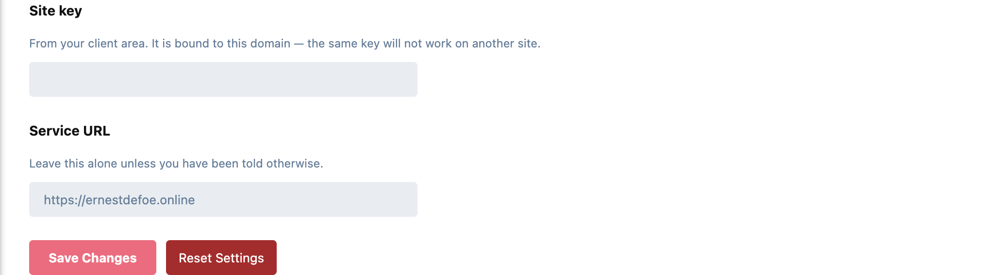

# Courier

Reply by email for Flarum. A member gets a notification, hits reply in whatever
mail client they already use, and their reply appears on the forum.

No mail server to run, no DNS records to add, no SMTP credentials to keep
working. Notifications about new posts are delivered for you, so they arrive
even on a forum whose own mail is misconfigured, which is most of the reason
replies go missing in the first place.

- **Reply from the inbox.** Someone replies to a discussion your member is watching. Courier sends them the notification with a reply address unique to them and that discussion. They answer it, and what they actually typed is posted under their own account, with the quoted history and their signature stripped.
- **A post like any other.** It notifies other participants, is indexed by search, and is screened by whatever moderation you run.
- **Replies collected every five minutes.** Email is not a real-time medium; a few minutes is invisible beside what mail already spends in transit.

## What it will not do

- **Post from a forged sender.** Who a reply is from is decided by the token in the address Courier issued, never by the `From:` header, which anyone can set to anything.
- **Post on behalf of someone who has lost permission.** Permissions are re-checked when the reply lands, not assumed from the fact they were emailed. An email round-trip is long enough for a member to be suspended.
- **Post auto-replies.** Out-of-office messages, bounces, mailing-list traffic and delivery reports are dropped. Otherwise an auto-responder answers a notification, the reply becomes a post, the post sends a notification, and a forum fills overnight.
- **Lose a notification when the service is down.** Anything the service cannot take is sent the ordinary way instead. Those members lose the ability to reply by email for that one message, which is far better than never hearing about it.

## Settings

Admin → Courier:



- **Site key:** from your client area. It is bound to your forum's domain, so the same key won't work on another site.
- **Service URL:** leave this alone unless you have been told otherwise.

## Good to know

- **It replaces Flarum's email notifications rather than adding to them,** so nothing goes out twice. Notifications that aren't about a post go out as Flarum's ordinary email. Members without a confirmed email address are not emailed.
- **Replies are collected by Flarum's scheduler.** Make sure `php flarum schedule:run` runs from cron every minute.
- **A subscription is required:** <https://ernestdefoe.online/account>. Requires Flarum 2.0 and PHP 8.3+.

## Installation

```bash
composer require ernestdefoe/courier
php flarum cache:clear
```

Then enable **Courier** in the admin panel and paste your site key. Nothing else to configure.

## Updating

```bash
composer update ernestdefoe/courier
php flarum cache:clear
```

## Support

- **Support site:** [ernestdefoe.online](https://ernestdefoe.online)
- **Issues:** [github.com/ernestdefoe/courier/issues](https://github.com/ernestdefoe/courier/issues)

## Licence

Proprietary, commercial licence. © 2026 ernestdefoe.
